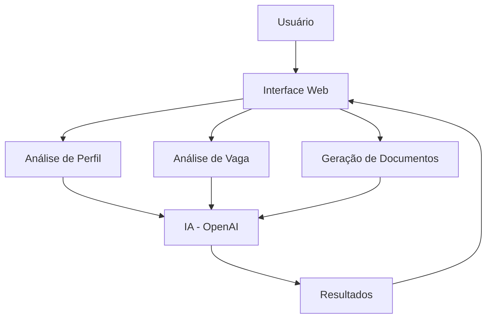
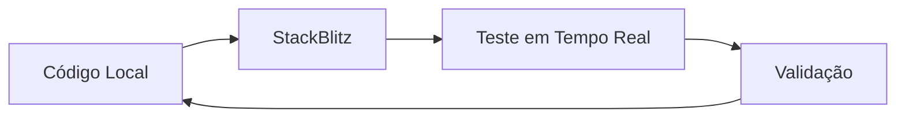
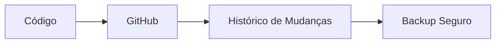
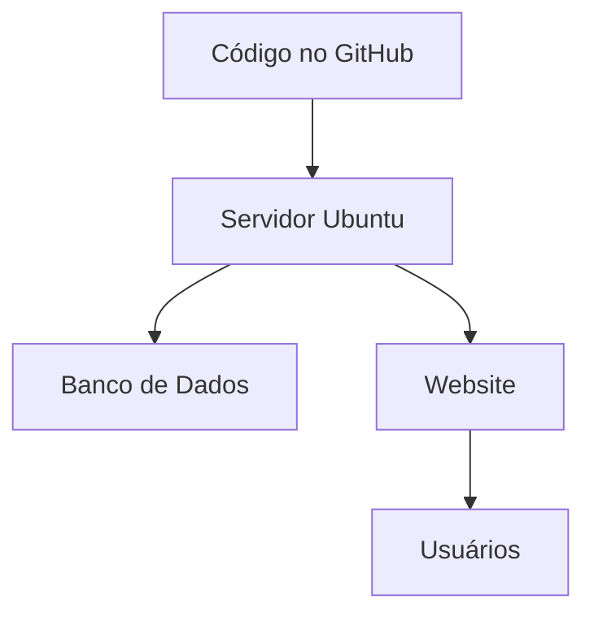

# Guia Completo do Projeto AI Platform

## Índice
1. [Visão Geral](#visão-geral)
2. [Fluxo de Trabalho](#fluxo-de-trabalho)
3. [Ambientes](#ambientes)
4. [Tecnologias](#tecnologias)
5. [Glossário Técnico](#glossário-técnico)
6. [Roteiro de Estudos](#roteiro-de-estudos)

## Visão Geral

Este projeto é uma plataforma de análise de perfis profissionais usando Inteligência Artificial. Imagine como um assistente virtual especializado em carreiras que ajuda pessoas a:
- Analisar compatibilidade com vagas
- Melhorar currículos
- Preparar para entrevistas
- Criar cartas de motivação

## Fluxo de Trabalho

### 1. Desenvolvimento (StackBlitz)

**Explicação para Leigos:**
- É como um "Word online" para programadores
- Você escreve o código e vê o resultado instantaneamente
- Não precisa instalar nada no computador

### 2. GitHub (Controle de Versão)

**Explicação para Leigos:**
- Como um "Google Drive" para código
- Guarda todas as versões do projeto
- Permite voltar atrás se algo der errado

### 3. Servidor (VPS)

**Explicação para Leigos:**
- Como um computador sempre ligado na internet
- Guarda os dados dos usuários
- Permite acesso ao site 24/7

## Ambientes

### 1. Desenvolvimento
- **StackBlitz**
  - Onde criamos e testamos o código
  - Interface visual amigável
  - Não requer instalações

### 2. Repositório
- **GitHub**
  - Armazena o código
  - Controla versões
  - Permite colaboração

### 3. Produção
- **VPS Ubuntu**
  - Servidor real
  - Banco de dados MySQL
  - Sistema em funcionamento

## Tecnologias

### Frontend (Parte Visual)
- **Next.js**: Framework para criar interfaces
- **Tailwind**: Estilização visual
- **React**: Biblioteca para interfaces interativas

### Backend (Servidor)
- **Node.js**: Ambiente de execução
- **Prisma**: Gerenciador de banco de dados
- **MySQL**: Banco de dados

### Inteligência Artificial
- **OpenAI**: Serviço de IA para análises

## Glossário Técnico

- **API**: Interface para comunicação entre sistemas
- **Framework**: Conjunto de ferramentas para desenvolvimento
- **VPS**: Servidor virtual privado
- **SSH**: Protocolo seguro para acessar servidores
- **Deploy**: Processo de publicar o sistema
- **Commit**: Salvar alterações no código
- **Push**: Enviar alterações para o GitHub
- **Pull**: Baixar alterações do GitHub

## Roteiro de Estudos

### Nível Iniciante
1. **HTML/CSS**
   - [MDN Web Docs](https://developer.mozilla.org/pt-BR/docs/Learn/HTML)
   - [W3Schools](https://www.w3schools.com/)

2. **JavaScript Básico**
   - [JavaScript.info](https://javascript.info/)
   - [Eloquent JavaScript](https://eloquentjavascript.net/)

3. **Git Básico**
   - [Git - guia prático](https://rogerdudler.github.io/git-guide/index.pt_BR.html)

### Nível Intermediário
1. **React**
   - [Documentação oficial](https://react.dev/)
   - [React Tutorial](https://react-tutorial.app/)

2. **Node.js**
   - [Node.js Documentation](https://nodejs.org/docs/latest/api/)

3. **Banco de Dados**
   - [MySQL Tutorial](https://www.mysqltutorial.org/)

### Nível Avançado
1. **Next.js**
   - [Next.js Documentation](https://nextjs.org/docs)

2. **Prisma**
   - [Prisma Documentation](https://www.prisma.io/docs)

3. **OpenAI**
   - [OpenAI Documentation](https://platform.openai.com/docs)

## Recomendações Adicionais

### Ferramentas para Aprendizado
- VS Code (editor de código)
- Postman (teste de APIs)
- MySQL Workbench (gerenciador de banco de dados)

### Canais no YouTube
- Rocketseat
- Fireship
- Traversy Media

### Comunidades
- Dev.to
- Stack Overflow
- GitHub Discussions

## Observações Finais

Este projeto utiliza tecnologias modernas e práticas recomendadas de desenvolvimento. Para um entendimento completo, recomenda-se seguir o roteiro de estudos na ordem apresentada, começando pelos conceitos básicos e progredindo gradualmente para os mais avançados.

Lembre-se: O aprendizado em programação é um processo contínuo. Não é necessário dominar todas as tecnologias de uma vez. Comece pelos fundamentos e vá avançando conforme sua compreensão aumenta.